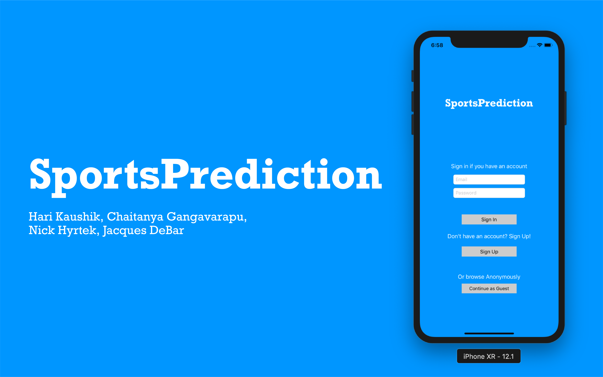

# SportsPrediction
An ios app that allows for predicting the outcomes of sporting events and competing against other players to see who is the best predictor

## User Goals:
 * Prediction/Gambling screen
 * History page to view past outcomes of games played
 * Leaderboard to show highscores amongst different users
 * Results page to view results of past predictions
 * User page to display user info if desired
 * Graph of data to show the user something based on that data (TBD later)
 
## Guest Goals: 
 * Be able to view leaderboards and see what players have the highest scores
 * View the games that are open to predictions but not make any predictions
 
## Optional Goals:
 * Create a way to track admin accounts and allow them to manage the leaderboard to maintain site integrity
 * Create a way for users to make groups with other users to compete within

### Current API:
 * I've decided that the best option for an API for live sports data would be TheRundown on RapidAPI. I've already subscribed to it, so just keep the calls to less than 100/day so I don't get charged, and we get unsubscribed because they can't charge an empty card.      
 * link to api: https://rapidapi.com/therundown/api/therundown
 * Key is in the view controlller
